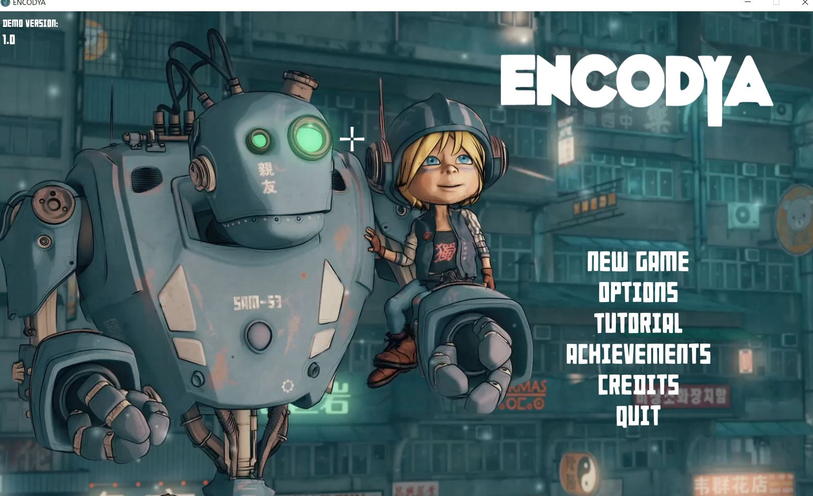
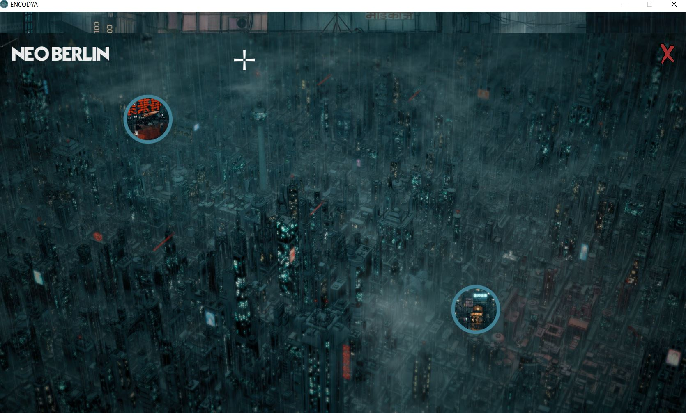
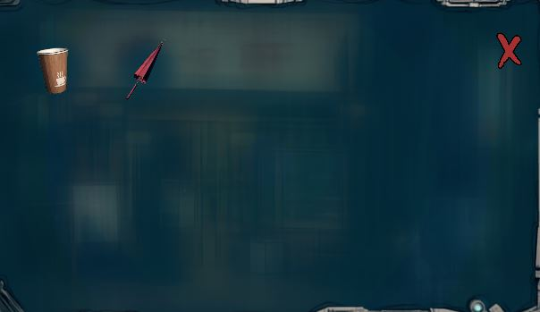

# ENCODYA

#### [Previous](Game Analysis.md)

### Game Analysis
my experience with ENCODYA while analysis second the game is a more graphical game then the Zordak. The settings can't hevily affect the game like Zordak but there's some settings. Unlike Zordak there is a way to return to the turturials just in case you new to refresh your way around the controls of the game. It also tracks some of your data like how long you've played it or how much of the gmae is completed but in this case it's a demo. It seem that the charaters we play is a robot and a small child in this game there is a clear story and nartaative. The games cutscenes have narration as well as the npcs and the sound is still emersive. S.A.M 54 (Robat) and Tina(Child) are set some what alone in this world with S.A.M as the guardian and protector of Tina. This game gives the ability to switch between the two as well as many dialogue options giving the feell of a indie version of Ratchet and Clank. Personally the game dialouge kind of funny but relateable and testing after getting to talk with some of the npcs. You can really waste time just talking and shearcing for things and the game will make fun of you for it by somewhat breaking the fourth wall but you won't regret it. ENCODYA has your basic todays standard version of a save and load file and a nice map with animations. Although the map was very apealing the inventory for the game was very lack luster in comparison. In terms of movement and gameplay there isn't much ENCODYA is just a point and click adventure game. I've spent time in ENCOYDA but didn't fet far not sure if I was stuck or if it was jyst due to it being a demo but the game has pontenial and for the most part intriguing.

#### [Return to main](https://jzm6677.github.io/Jay_Site/)
