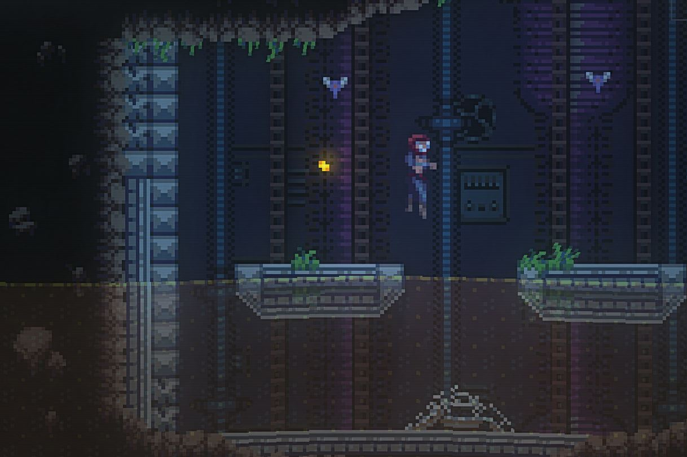
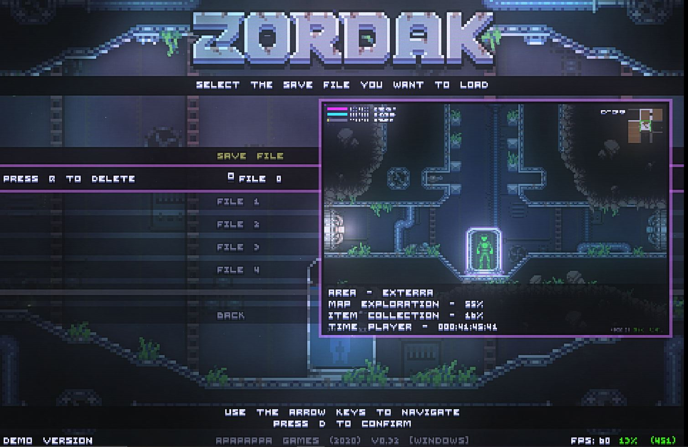
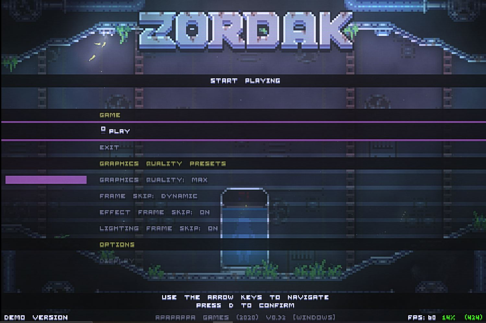
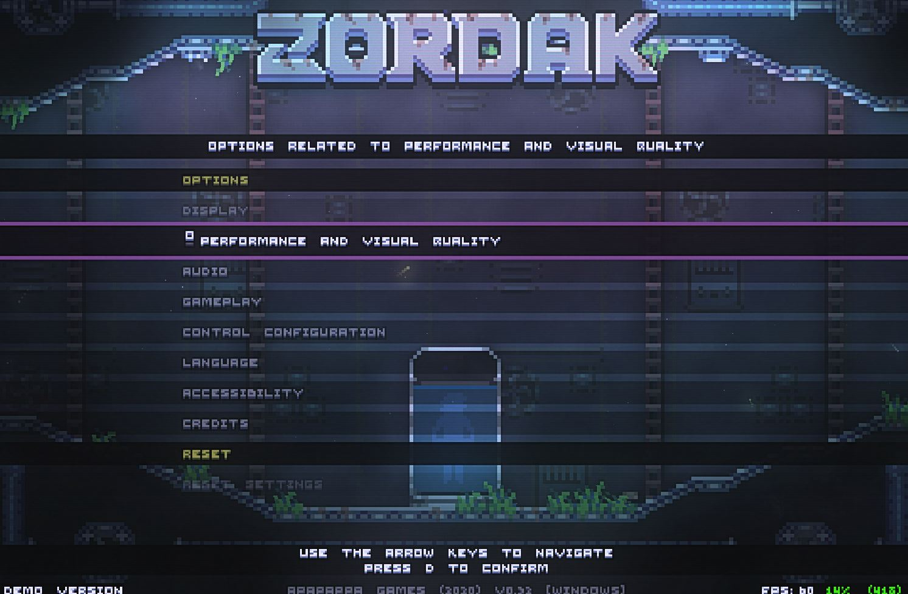
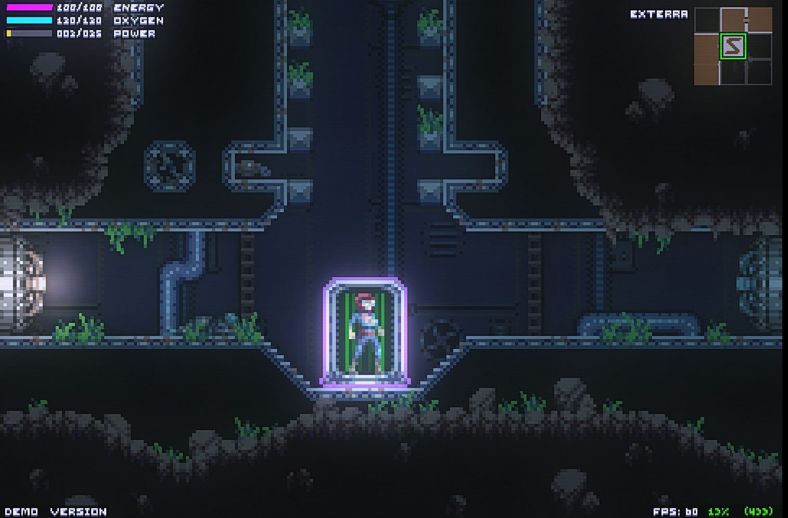
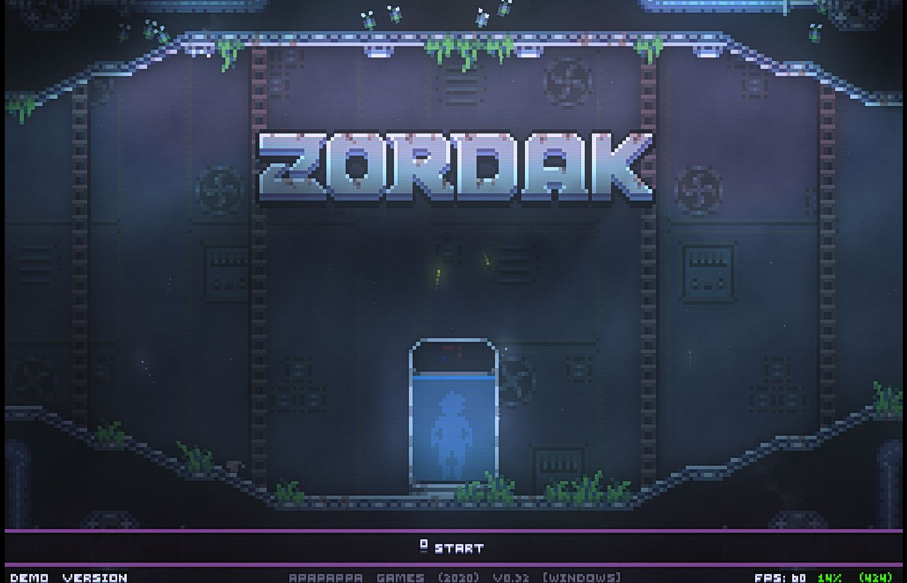
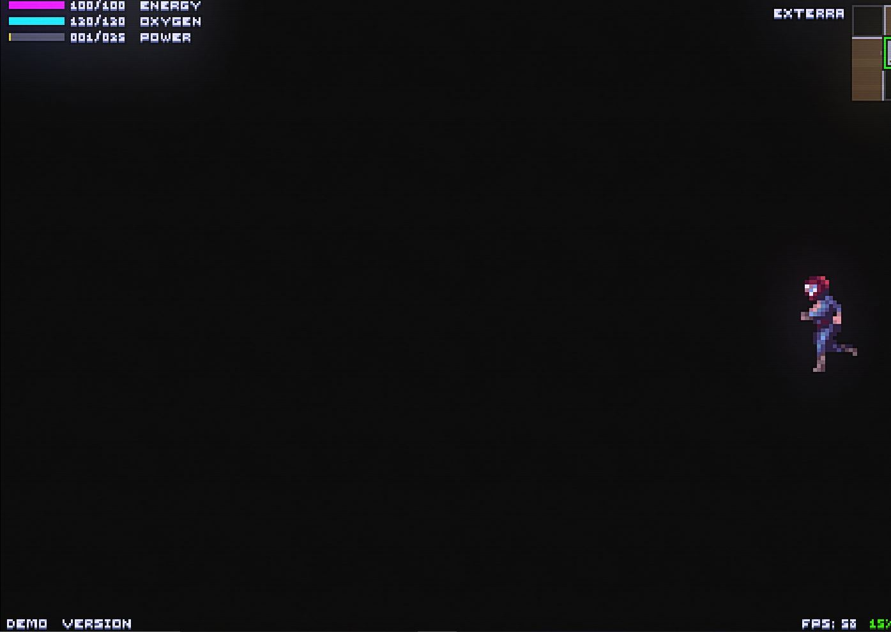

# ZORDAK

#### [Previous](Game Analysis.md)

### Game Analysis
my experience with Zordak while analysis first the game is a pixel game that give you a track at where your frame rate is at. The settings can hevily affect the games visual, perfomace, audio and even gameplay controls. It seem that the charater we played as was a lone sutvior of a space mission whos now stuck on a watsed plant called zodark and the sound of electricty and water really help give off  that feel. There is not much to the game, its just simple rpg like game where you are just trying to avoid danger and get to the next level. Personally the game seems kind of fun but what ive noticed from the few hours i spent with it, although the different levels change a little bit, they all seem kind of similar which made it kind of bland. After the time I spent playing the game, i still have not seen any directing towards the story element of the game. Althought that is the case the game is still something to check out. Especially if your the type the of person who likes games that makes you solve pulzzes and make your expore it's world. As an indie it is visually appealing and the sound is immersive to engage into the world of Zordak.

